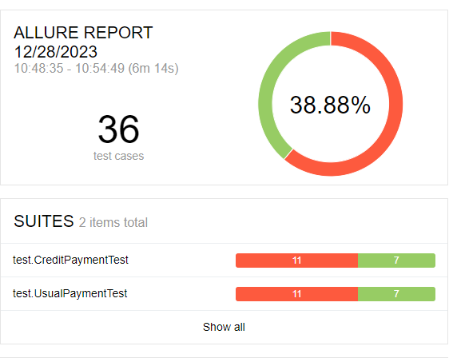

# Отчет о проведенном тестировании:
## Краткое описание:
В процессе работы над проектом было проведено тестирование приложения веб-сервиса, который предлагает купить тур, взаимодействующего с СУБД и API Банка.

Тестирование проводилось при подключении к БД MySql и PostgreSQL.

Общее количество тестов: 36

Количество оформленных баг-репортов: 10.

## Отчет автотестов Allure при подключении к БД PostgreSQL и к БД MySql:

Всего тест-кейсов:
* Успешных: 7 + 7.
* Неуспешных: 11 + 11.

## Общие рекомендации:
1. Необходима документация.