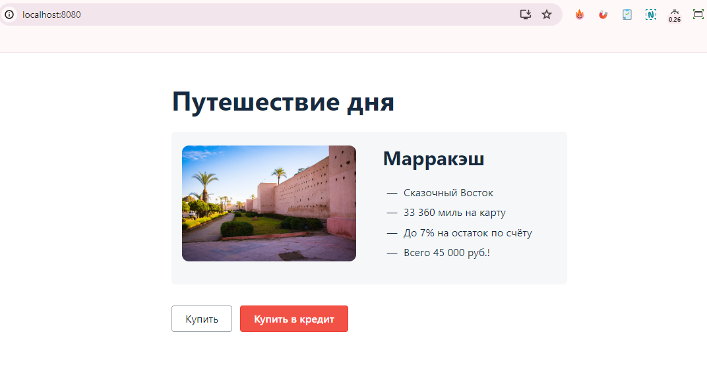
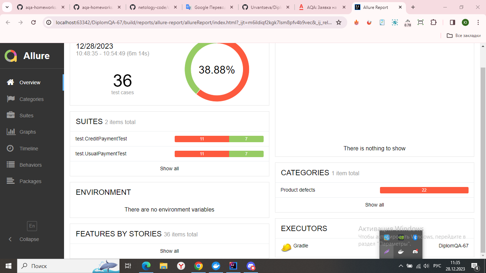

# Дипломный проект по профессии «Тестировщик».

Дипломный проект — автоматизация тестирования комплексного сервиса, взаимодействующего с СУБД и API Банка.

## О проекте:
Приложени веб-сервиса, которое предлагает купить тур по определённой цене двумя способами:

1. Обычная оплата по дебетовой карте.
2. Уникальная технология: выдача кредита по данным банковской карты.



Само приложение не обрабатывает данные по картам, а пересылает их банковским сервисам:
* сервису платежей, далее Payment Gate;
* кредитному сервису, далее Credit Gate.

Приложение в собственной СУБД должно сохранять информацию о том, успешно ли был совершён платёж и каким способом. Данные карт при этом сохранять не допускается.

## Цель проекта:

Автоматизация тестирования комплексного сервиса, взаимодействующего с СУБД и API Банка.

## Запуск приложения:

1. Клонировать репозиторий командой `git clone` - `https://github.com/Urvantseva/DiplomQA-67.git`
2. Запустить Docker.
3. Открыть проект в IntelliJ IDEA.
4. В терминале IntelliJ IDEA запустить необходимые базы данных и нужные контейнеры командой `docker-compose up`.
5. В новой вкладке терминала ввести следующие команды:
- `java "-Dspring.datasource.url=jdbc:mysql://localhost:3306/app" -jar artifacts/aqa-shop.jar`.
- `java "-Dspring.datasource.url=jdbc:postgresql://localhost:5432/app" -jar artifacts/aqa-shop.jar`.
6. Проверить доступность приложения в браузере по адресу: `http://localhost:8080/`.

## Запуск тестов:

В новой вкладке терминала ввести следующие команды:
- ```./gradlew clean test "-D db.url=jdbc:mysql://localhost:3306/app"```.
- ```./gradlew clean test "-D db.url=jdbc:postgresql://localhost:5432/app"```.

## Просмотр отчетов по результатам тестирования:

1. Сгенерировать отчет Allure, в IntelliJ IDEA выполнить команду: ```./gradlew allureServe```.
2. Отчёт не открылся  автоматически в браузере:
- Выполнить команду: ```./gradlew allureReport```.
- Открыть отчет вручную: ```.\build\.reports\allure-report\*index.html```, открыть в браузере.

